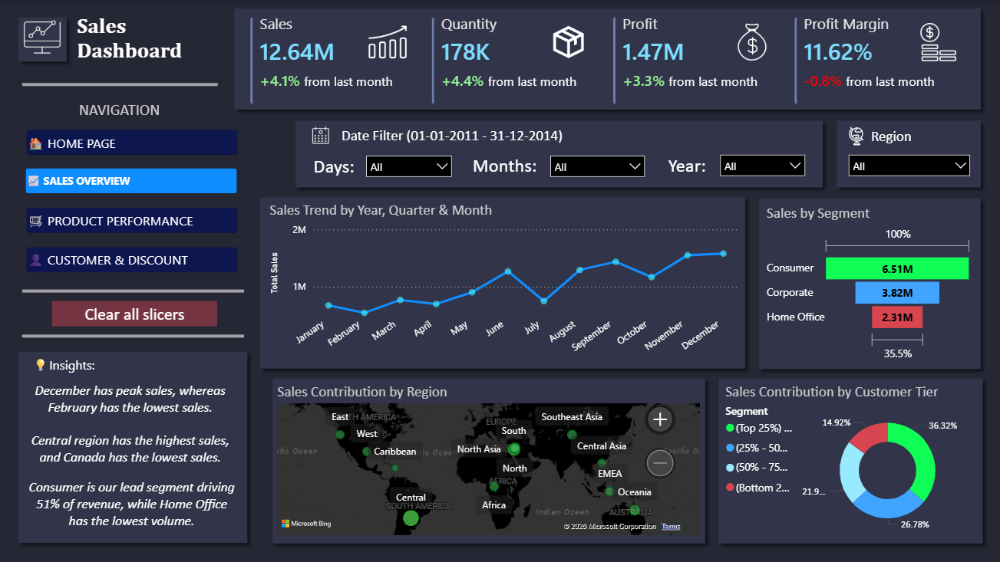
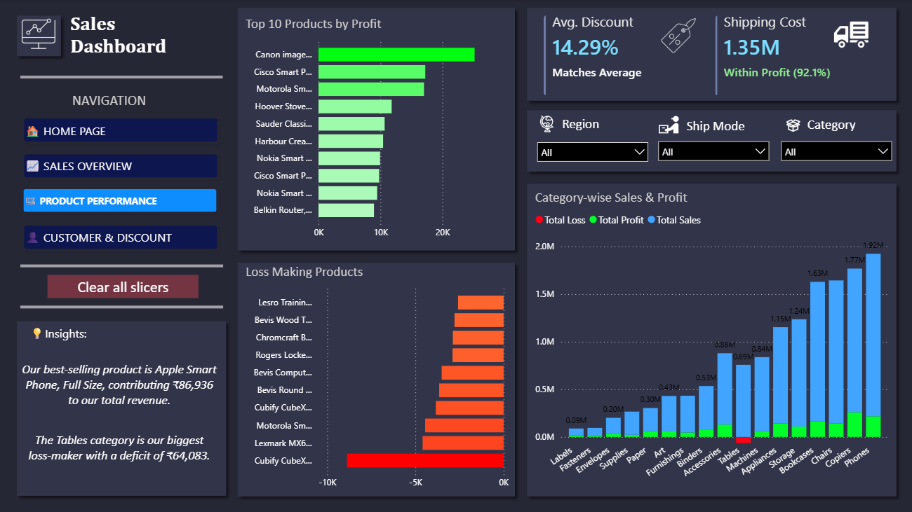
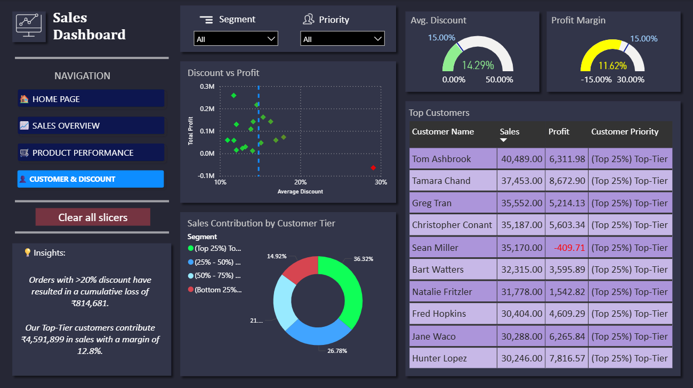

# 📈 Sales Performance & Business Insights System

The Profit Leak Investigation: A Data-Driven Audit of ₹1.2 Cr Sales using Python, SQL, Excel and Strategic Power BI Dashboards.

* 📜 **Detailed Project Analysis:** [Click here to view the Full Project Report (PDF)](https://github.com/vaibhavpal0226/sales-performance-and-business-insights-system/blob/main/Sales%20Performance%20%26%20Business%20Insights%20System.pdf)


---

## 📖 Table of Contents
1. <a href="#project-overview">Project Overview</a>
2. <a href="#problem-statement">Problem Statement</a>
3. <a href="#dataset-information">Dataset Information</a>
4. <a href="#tools-used">Tools Used</a>
5. <a href="#project-structure">Project Structure</a>
6. <a href="#technical-workflow">Technical Workflow</a>
    * <a href="#phase-1-engineering">Phase 1: Data & Feature Engineering</a>
    * <a href="#phase-2-sql">Phase 2: SQL Business Logic</a>
    * <a href="#phase-3-excel">Phase 3: Excel Statistical Analysis & Pivot Charts</a>
    * <a href="#phase-4-powerbi">Phase 4: Power BI Storytelling</a>
7. <a href="#key-business-insights">Key Business Insights</a>
8. <a href="#dashboard-previews">Dashboard Previews</a>
9. <a href="#final-recommendations">Final Recommendations</a>
10. <a href="#detailed-report">Detailed Findings Report</a>
11. <a href="#how-to-run-this-project">How to Run This Project</a>
12. <a href="#note-on-security">Note on Security</a>
13. <a href="#author--contact">Author & Contact</a>

---
<h2 id="project-overview">🎯 Project Overview</h2>

This project focuses on analyzing large-scale sales data to uncover key business insights and improve decision-making. Using Python, SQL, Excel, and Power BI, I transformed raw data into a structured analytics system that highlights performance trends, profitability drivers, and operational inefficiencies.

---

<h2 id="problem-statement">❓ Problem Statement</h2>

Businesses often face a situation where sales are increasing but profits are not, making it difficult to evaluate true performance.
This project aims to answer:
**How can we analyze sales data to identify key drivers of revenue and profitability, and provide actionable business insights?**

---

<h2 id="dataset-information">📊 Dataset Information</h2>

The data used in this project is sourced from Kaggle. The dataset consists of 50,000+ sales records covering customers, products, regions, and transactions.
* **Source:** [SuperStore Sales Dataset by Aditi Saxena](https://www.kaggle.com/datasets/aditisaxena20/superstore-sales-dataset)
* **Records:** 50,000+
* **Features:** Orders, Customers, Products, Regions, Sales, Profit, Discount, Shipping

---

<h2 id="tools-used">🛠️ Tools Used</h2>

| Domain | Tools & Technologies | Purpose |
| :--- | :--- | :--- |
| Data Engineering | Python (Pandas, NumPy) | Automated Ingestion, SQLAlchemy, Data Cleaning, Feature Engineering |
| Database | MySQL | Relational Schema, CTEs, Window Functions, Subqueries |
| Data Visualization | Excel | EDA, Correlation Heatmaps, Outlier Detection, Distribution Analysis, Pivot Tables & Charts |
| Business Intelligence | Power BI | DAX Measures, Interactive Storytelling, Dynamic Insights, Stakeholder Dashboards |

---

<h2 id="project-structure">📂 Project Structure</h2>

```
├── data/
|   └── superstore_orders.csv
├── logs/
|   └── ingestion_db.log                   
├── scripts/
│   └── ingestion_db.py                                           # Python script for SQL migration & logging
├── notebooks/
│   └── data_cleaning_and_preprocessing.ipynb                     # Cleaning & Feature Engineering
├── sql/
│   └── querying_and_business_analysis.sql                        # Business logic & analytical questions
├── excel/
│   └── quick_analysis_and_vaildation.xlsx                        # Statistical Analysis & Data Validation   
├── dashboard/
│   └── dashboard_and_storytelling.pbix                           # Multi-page Power BI Dashboard
├── images/
│   |── dashboard1.png
|   |── dashboard2.png
|   └── dashboard3.png  
├── Sales Performance & Business Insights System.pdf              # Detailed project documentation
└── README.md                                                     # Project documentation
```

---

<h2 id="technical-workflow">🏗️ Technical Workflow</h2>

<h3 id="phase-1-engineering">🐍 Phase 1: Data & Feature Engineering</h3>

* **Ingestion:** Developed a Python script with `SQLAlchemy` and `logging` to migrate raw CSVs to MySQL using a standardized `snake_case` schema.
* **Data Cleaning:**
   * Converted date columns to datetime format.
   * Removed inconsistent and invalid records.    
* **Feature Engineering:** Created key features::
   * Profit Margin → Performance metric
   * Delivery Days → Operational efficiency
   * High Discount Flag → Discount impact analysis

<h3 id="phase-2-sql">🗄️ Phase 2: SQL Business Logic</h3>

Performed structured analysis using SQL:
* Total sales, profit, and quantity
* Monthly and seasonal trends
* Top and loss-making products
* Region-wise performance
* Discount impact on profit
* Customer segmentation using NTILE

<h3 id="phase-3-excel">📊 Phase 3: Excel Statistical Analysis & Pivot Charts</h3>

* Created pivot tables and charts for validation
* Performed statistical analysis:
   - Distribution analysis
   - Outlier detection
   - Correlation heatmap

<h3 id="phase-4-powerbi">📈 Phase 4: Power BI Storytelling</h3>

Built a 3-page interactive dashboard:

🔹 Sales Overview
   * KPIs: Sales, Profit, Quantity, Profit Margin
   * Sales trends & regional performance
🔹 Product Performance
   * Top vs loss-making products
   * Category-level insights
🔹 Customer & Discount Analysis
   * Customer segmentation
   * Discount vs profit analysis

---

<h2 id="key-business-insights">📈 Key Business Insights</h2>

- High discounts (>20%) significantly reduce profit margins
- Discounts do not strongly increase sales volume
- Top-Tier customers drives most revenue
- Some products generate high sales but consistent losses
- Sales show strong seasonality (peak in Nov–Dec)
- Shipping cost and delivery time impact profitability

---

<h2 id="dashboard-previews">📊 Dashboard Previews</h2>

### **Page 1: Sales Overview**


### **Page 2: Product Performance**


### **Page 3: Customer & Discount**


---

<h2 id="final-recommendations">🏁 Final Recommendations</h2>

* Limit discounts to protect profit margins
* Focus on high-margin products (especially Technology category)
* Optimize logistics to reduce shipping costs
* Encourage standard shipping for better profitability
* Build loyalty programs for high-value customers

---

<h2 id="detailed-report">📄 Detailed Findings Report</h2>

*For a detailed breakdown of the findings, please refer to the [Sales Performance & Business Insights System Report](https://github.com/vaibhavpal0226/sales-performance-and-business-insights-system/blob/main/Sales%20Performance%20%26%20Business%20Insights%20System.pdf).*

---

<h2 id="how-to-run-this-project">⚙️ How to Run This Project</h2>

1. **Clone the Repository**
Open your terminal or command prompt and run:
```bash
git clone https://github.com/vaibhavpal0226/indian-real-estate-investment-risk-analysis.git
```

2. **Database Setup:**
   * Create a MySQL database named `sales_analysis`.
   * Update the connection string in `ingestion_db.py` with your username and password. Also update log_directory and target_folder.
3. **Environment:**
   * Install dependencies: `pip install pandas numpy sqlalchemy mysql-connector-python matplotlib seaborn`.
4. **Data Pipeline:**
   * Run `ingestion_db.py` to load data into SQL.
   * Execute `data_cleaning_and_preprocessing.ipynb` to process and clean the data.
5. **Analysis:**
   * Run `querying_and_business_analysis.sql` in your MySQL Workbench to view business insights.
   * Open `quick_analysis_and_vaildation.xlsx` for statistical visualizations.
6. **Dashboard:**
   * Open `dashboard_and_storytelling.pbix` in **Power BI Desktop** to explore the interactive report.
   * **Note:** To view the Power BI dashboard with your data, go to **Transform Data > Data Source Settings** and update the server/database to match your local MySQL environment.

---

<h2 id="note-on-security">🔒 Note on Security</h2>

Database credentials have been removed for security. Users can replicate the environment by substituting their own credentials in the connection strings.

---

<h2 id="author--contact">👤 Author & Contact</h2>

**Vaibhav Pal** <br>
Aspiring Data Analyst
* Email: vaibhav2021official@gmail.com
* LinkedIn: https://www.linkedin.com/in/vaibhav-pal26/
* Portfolio: https://github.com/vaibhavpal0226

---
